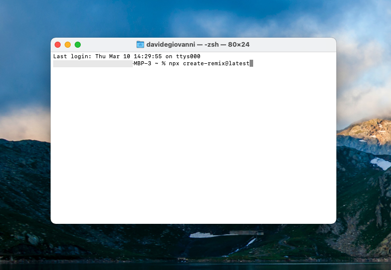
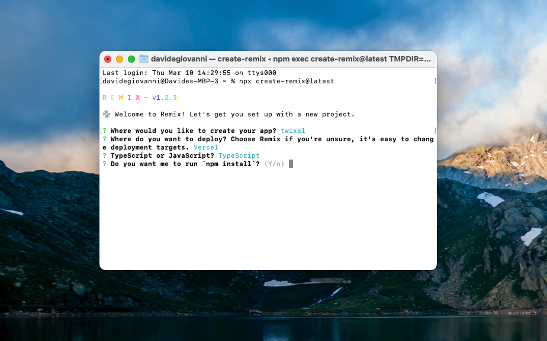

## Genera un nuovo progetto di Remix

|                                            | Capitolo successivo                                                                    |
| :----------------------------------------- | -------------------------------------------------------------------------------------: |
| [◀︎ 00-setup](../00-setup) | [02-esplora-struttura-progetto ▶︎](../02-esplora-struttura-progetto) |


💿 Apri il terminale ed esegui questo comando:

```sh
npx create-remix@latest
```

> Potrebbe venirti chiesto se vuoi installare `create-remix`. Premi `y` e invio. Si tratta di un'installazione temporanea necessaria per fare il setup del progetto.



Quando le animazioni di Remix sono finite, ti verranno chieste un paio di domande per creare e fare il setup del progetto. Chiameremo l'app **"twixel"**, useremo "Vercel" come deploy target, e TypeScript. Al termine nel terminale dovresti avere il seguente setup:

```
R E M I X - v#.#.#

💿 Welcome to Remix! Let's get you set up with a new project.

? Where would you like to create your app? twixel
? Where do you want to deploy? Choose Remix if you're unsure, it's easy to change deployment targets. Vercel
? TypeScript or JavaScript? TypeScript
? Do you want me to run `npm install`? Yes
```



Una volta che l'installazione è completata, è l'ora di aprire la cartella di `twixel`:

💿 Se vuoi aprire il progetto da terminale puoi eseguire questi comandi: 

```sh
cd twixel # per entrare nella cartella
code . # per aprire il progetto su VSCode

```

> In alternativa puoi trascinare la cartella sull'icona di **VSCode** oppure aprire **Visual Studio Code** e tramite il menù aprire la cartella `twixel`