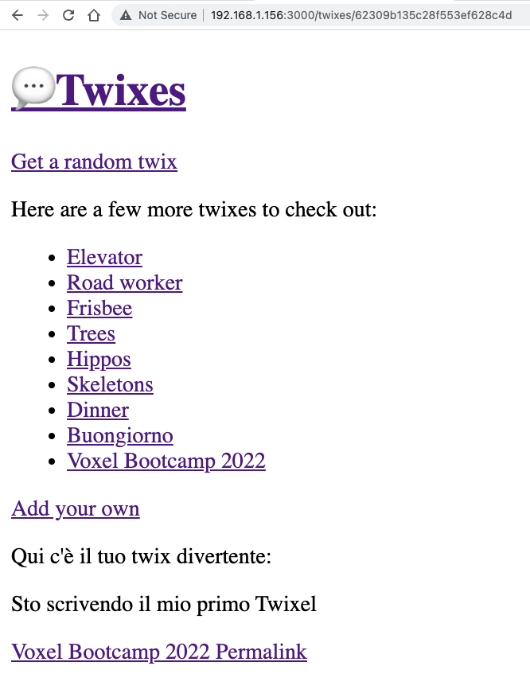

## Mutazioni

| Capitolo precedente  | Capitolo successivo     |
| :--------------- | ---------------: |
| [◀︎ 04-database](../04-database)| [06-authentication ▶︎](../06-authentication) |


Nei precedenti capitoli abbiamo creato una pagina al link `/twixes/new`, ma per ora il form che vediamo non fa ancora nulla. Questo dovrebbe essere il codice presente nel file `app/routes/twixes/new.tsx` (è importante che sia presente il `method="post"`, quindi controlla che ci sia):

```tsx filename=app/routes/twixes/new.tsx
export default function NewTwixRoute() {
  return (
    <div>
      <p>Add your own hilarious twix</p>
      <form method="post">
        <div>
          <label>
            Title: <input type="text" name="title" />
          </label>
        </div>
        <div>
          <label>
            Content: <textarea name="content" />
          </label>
        </div>
        <div>
          <button type="submit" className="button">
            Add
          </button>
        </div>
      </form>
    </div>
  );
}
```

La chiamata per creare un nuovo twix utilizzando Prisma è la seguente:

```tsx
const twix = await db.twix.create({
  data: { title, content },
});
```

💿 Crea una `action` nel file `app/routes/twixes/new.tsx`.

<details>

<summary>app/routes/twixes/new.tsx</summary>

```tsx filename=app/routes/twixes/new.tsx lines=[1-2,4,6-25]
import type { ActionFunction } from "remix";
import { redirect } from "remix";

import { db } from "~/utils/db.server";

export const action: ActionFunction = async ({
  request,
}) => {
  const form = await request.formData();
  const title = form.get("title");
  const content = form.get("content");
  // qui facciamo un piccolo type check per rendere TypeScript felice
  // dopo ci occuperemo della validazione!
  if (
    typeof title !== "string" ||
    typeof content !== "string"
  ) {
    throw new Error(`Ci sono errori nel form`);
  }

  const fields = { title, content };

  const twix = await db.twix.create({ data: fields });
  return redirect(`/twixes/${twix.id}`);
};

export default function NewTwixRoute() {
  return (
    <div>
      <p>Crea il tuo twix</p>
      <form method="post">
        <div>
          <label>
            Titolo: <input type="text" name="title" />
          </label>
        </div>
        <div>
          <label>
            Contenuto: <textarea name="content" />
          </label>
        </div>
        <div>
          <button type="submit" className="button">
            Aggiungi
          </button>
        </div>
      </form>
    </div>
  );
}
```

</details>

Con il codice appena scritto dovresti essere in grado di creare dei nuovi twix ed essere redirezionata alla pagina del twix una volta salvato.

La funzione `redirect` che abbiamo usato è una semplice utility di Remix. Con questa utility possiamo impostare i corretti valori degli header HTML che ci permettono di redirezionare l'utente all'interno della nostra app dove vogliamo, informando correttamente il browser.




Fantastico! Con un semplice form e delle semplici funzioni per inviare il nostro twix al database sei riuscita a creare un nuovo twix.

Un'altro aspetto da notare è che quando vieni redirezionata alla pagina del nuovo twix appena creato, vedrai tutti i dati senza doverti occupare della gestione della cache. Dell'invalidazione della cache se ne occupa Remix automaticamente 😎

## Validazioni

Ora perché non aggiungiamo delle validazioni? Con le validazioni, controlliamo che i nostri valori abbiano le caratteristiche minime per essere accettabili.

> Prima di occuparcene, c'è una piccola cosa che da sapere riguardo al funzionamento delle funzione `actions`. Il valore che la funzione ritorna dev'essere lo stesso che ritorna la funzione `loader`: Una risposta o un oggetto Javascript.

💿 Ora continua con le validazioni di `title` e `content` affinché abbiano una lunghezza minima. Per esempio possiamo indicare che il titolo debba essere lungo almeno 2 caratteri e che il contenuto sia di almeno 10 caratteri.

<details>

<summary>app/routes/twixes/new.tsx</summary>

```tsx filename=app/routes/twixes/new.tsx lines=[2,6-10,12-16,18-28,30-31,43-45,48-51,53-55,62,73,75-83,86-94,100,102-110,113-121]
import type { ActionFunction } from "remix";
import { useActionData, redirect, json } from "remix";

import { db } from "~/utils/db.server";

function validateTwixContent(content: string) {
  if (content.length < 10) {
    return `Il twix è troppo corto`;
  }
}

function validateTwixTitle(title: string) {
  if (title.length < 3) {
    return `Il titolo è troppo corto`;
  }
}

type ActionData = {
  formError?: string;
  fieldErrors?: {
    title: string | undefined;
    content: string | undefined;
  };
  fields?: {
    title: string;
    content: string;
  };
};

const badRequest = (data: ActionData) =>
  json(data, { status: 400 });

export const action: ActionFunction = async ({
  request,
}) => {
  const form = await request.formData();
  const title = form.get("title");
  const content = form.get("content");
  if (
    typeof title !== "string" ||
    typeof content !== "string"
  ) {
    return badRequest({
      formError: `Form not submitted correctly.`,
    });
  }

  const fieldErrors = {
    title: validateTwixTitle(title),
    content: validateTwixContent(content),
  };
  const fields = { title, content };
  if (Object.values(fieldErrors).some(Boolean)) {
    return badRequest({ fieldErrors, fields });
  }

  const twix = await db.twix.create({ data: fields });
  return redirect(`/twixes/${twix.id}`);
};

export default function NewTwixRoute() {
  const actionData = useActionData<ActionData>();

  return (
    <div>
      <p>Add your own hilarious twix</p>
      <form method="post">
        <div>
          <label>
            Title:{" "}
            <input
              type="text"
              defaultValue={actionData?.fields?.title}
              name="title"
              aria-invalid={
                Boolean(actionData?.fieldErrors?.title) ||
                undefined
              }
              aria-errormessage={
                actionData?.fieldErrors?.title
                  ? "name-error"
                  : undefined
              }
            />
          </label>
          {actionData?.fieldErrors?.title ? (
            <p
              className="form-validation-error"
              role="alert"
              id="name-error"
            >
              {actionData.fieldErrors.title}
            </p>
          ) : null}
        </div>
        <div>
          <label>
            Content:{" "}
            <textarea
              defaultValue={actionData?.fields?.content}
              name="content"
              aria-invalid={
                Boolean(actionData?.fieldErrors?.content) ||
                undefined
              }
              aria-errormessage={
                actionData?.fieldErrors?.content
                  ? "content-error"
                  : undefined
              }
            />
          </label>
          {actionData?.fieldErrors?.content ? (
            <p
              className="form-validation-error"
              role="alert"
              id="content-error"
            >
              {actionData.fieldErrors.content}
            </p>
          ) : null}
        </div>
        <div>
          <button type="submit" className="button">
            Add
          </button>
        </div>
      </form>
    </div>
  );
}
```

</details>

Ottimo! Ora hai un form che valida i campi sul server e mostra sul client gli errori!


Ora riguardando il codice, andiamo a capire al meglio alcuni aspetti.

Per prima cosa andiamo a notare come il tipo di `ActionData` abbia un po' di _type safety_ ovvero ci garantisce un controllo nel caso stiamo scrivendo dei dati in cui mancano proprietà o abbiano un formato sbagliato. 
Ricorda che `useActionData` può ritornare `undefined` se l'action non è stata ancora chiamata, quindi abbiamo bisogno di una programmazione un po' difensiva che controlli prima che `useActionData` sia definito.

Possiamo anche notare come vengono ritornati tutti i campi del form. Questo è per far si che il form possa essere nuovamente renderizzato con i valori inviati dal server se Javascript dovesse avere problemi a caricare per qualche ragione.

La funzione `badRequest` è importante perché ci permette di fare un _typechecking_ che assicura di ritornare lo stesso valore di `ActionData` con anche le informazioni accurate riguardo allo status HTTP, [`400 Bad Request`](https://developer.mozilla.org/en-US/docs/Web/HTTP/Status/400). Se ritornassimo sempre solo il valore di `ActionData` senza lo status, questo causerebbe sempre una risposa`200 OK`, che non ci permetterebbe di gestire gli errori del form con conseguenze anche lato SEO (vedremo questo capitolo più avanti).

Un'altra cosa da notare è la programmazione e il modo dichiarativo utilizzato. Non dobbiamo pensare a gestire lo stato della vista perchè le `actions` ottengono i dati, questi vengono poi processati e il componente infine utilizza i dati e li renderizza.

E se volessi validare il form client side nel browser (ad esempio mentre l'utente sta scrivendo), ti basterebbe chiamare le due funzioni `validateTwixContent` e `validateTwixTitle`!

| Capitolo precedente  | Capitolo successivo     |
| :--------------- | ---------------: |
| [◀︎ 04-database](../04-database)| [06-authentication ▶︎](../06-authentication) |