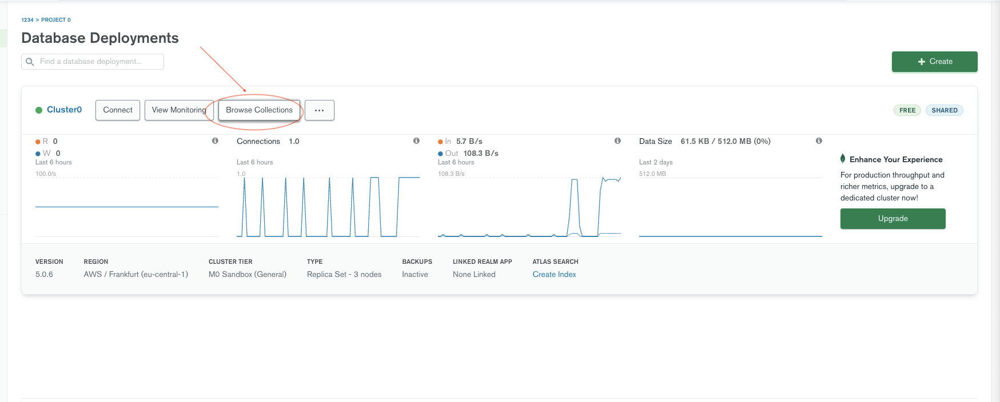
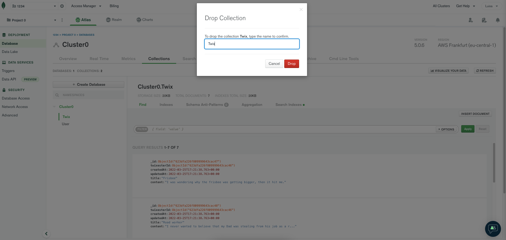
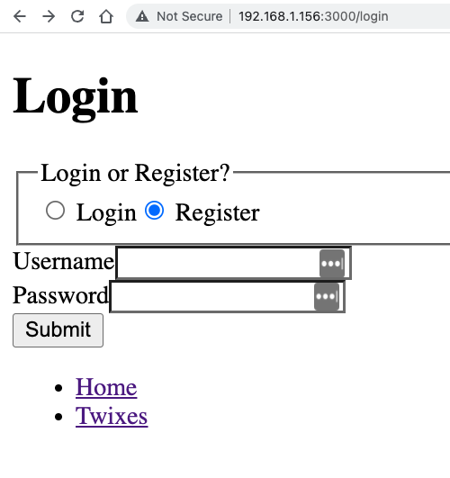
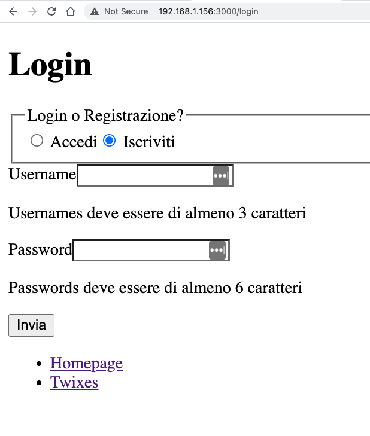
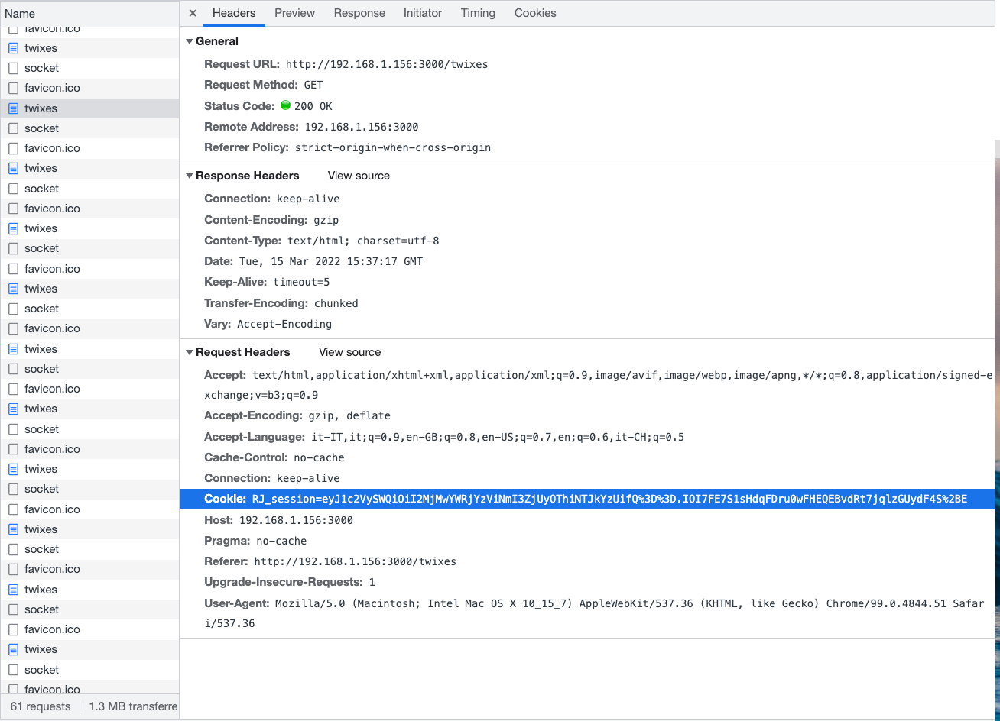

## Autenticazione

| Capitolo precedente  | Capitolo successivo     |
| :--------------- | ---------------: |
| [◀︎ 05-mutations](../05-mutations)| [07-unexpected-errors ▶︎](../07-unexpected-errors) |

È arrivato il momento che stavamo aspettando! Adesso aggiungerai l'autenticazione alla tua applicazione: grazie all'autenticazione riuscirai ad associare ogni twix all'utente che l'ha creato!

Da sapere per questa sezione è cosa sono i [cookies HTTP](https://developer.mozilla.org/en-US/docs/Web/HTTP/Cookies) e come funzionano sul web.

Ci sono tanti modi per aggiungere l'autenticazione ad un'app, ad esempio puoi utilizzare dei servizi tipo [Auth0](https://auth0.com/). Oggi però realizzerai la tua autenticazione da zero - non preoccuparti, non è così spaventoso come può sembrare.

### Prepara il database

Iniziamo andando ad aggiornare il file `prisma/schema.prisma` nel seguente modo:

```prisma filename=prisma/schema.prisma lines=[13-20,24-25]
// This is your Prisma schema file,
// learn more about it in the docs: https://pris.ly/d/prisma-schema

generator client {
  provider = "prisma-client-js"
  previewFeatures = ["mongoDb"]
}

datasource db {
  provider = "mongodb"
  url      = env("DATABASE_URL")
}

model User {
  id       String @id @default(auto()) @map("_id") @db.ObjectId
  createdAt    DateTime @db.Date @default(now())
  updatedAt    DateTime @db.Date @default(now())
  username     String   @unique
  passwordHash String
  twixes        Twix[]
}

model Twix {
  id       String @id @default(auto()) @map("_id") @db.ObjectId
  twixesterId String @db.ObjectId
  twixester   User     @relation(fields: [twixesterId], references: [id])
  createdAt  DateTime @db.Date @default(now())
  updatedAt  DateTime @db.Date @default(now())
  title       String
  content    String
}
```

Prima di eseguire questo comando elimina la collezione che hai creato sul database di Mongo dato che abbiamo creato un nuovo tipo di dato. Ecco come fare:

- Da MongoDB vai su `Browse Collections`


- Seleziona la collezione `Twix` ed eliminala e fai lo stesso per la collezione `User`



Adesso che abbiamo aggiornato lo schema puoi eseguire il seguente comando:

```sh
npx prisma db push
```

Questo comando ti darà questo output:

```sh
Environment variables loaded from .env
Prisma schema loaded from prisma/schema.prisma
Datasource "db"

🚀  Your database is now in sync with your schema. Done in 194ms

✔ Generated Prisma Client (3.10.0 | library) to ./node_modules/@prisma/client in 167ms
```

Con questo cambio, inizieremo a visualizzare alcuni errori di TypeScript nel progetto perchè non potrai più creare `twix` senza un valore per il `twixsterId`.

**Prima di generare l'utente chiudi e riapri l'editor Visual Studio Code in modo che l'editor si accorga del cambiamento di Prisma.**

💿 Cominciamo sistemando il nostro file `prisma/seed.ts`.

```ts filename=prisma/seed.ts lines=[5-12,15-16]
import { PrismaClient } from "@prisma/client";
const db = new PrismaClient();

async function seed() {
  const kody = await db.user.create({
    data: {
      username: "kody",
      // this is a hashed version of "twixrox"
      passwordHash:
        "$2b$10$K7L1OJ45/4Y2nIvhRVpCe.FSmhDdWoXehVzJptJ/op0lSsvqNu/1u",
    },
  });
  await Promise.all(
    getTwixes().map((twix) => {
      const data = { twixesterId: kody.id, ...twix };
      return db.twix.create({ data });
    })
  );
}

seed();

function getTwixes() {
  // shout-out to https://icanhazdadtwix.com/

  return [
    {
      title: "Road worker",
      content: `I never wanted to believe that my Dad was stealing from his job as a road worker. But when I got home, all the signs were there.`,
    },
    {
      title: "Frisbee",
      content: `I was wondering why the frisbee was getting bigger, then it hit me.`,
    },
    {
      title: "Trees",
      content: `Why do trees seem suspicious on sunny days? Dunno, they're just a bit shady.`,
    },
    {
      title: "Skeletons",
      content: `Why don't skeletons ride roller coasters? They don't have the stomach for it.`,
    },
    {
      title: "Hippos",
      content: `Why don't you find hippopotamuses hiding in trees? They're really good at it.`,
    },
    {
      title: "Dinner",
      content: `What did one plate say to the other plate? Dinner is on me!`,
    },
    {
      title: "Elevator",
      content: `My first time using an elevator was an uplifting experience. The second time let me down.`,
    },
  ];
}
```

💿 Ottimo, ora avvia di nuovo il comando per genearare dei twix di prova:

```sh
npx prisma db seed
```

Ottimo! Ora il database è pronto.

### Rivediamo il flow di autenticazione

La nostra autenticazione sarà tradizionale, con username e password. Useremo la libreria [`bcryptjs`](https://npm.im/bcryptjs) per "mascherare" (in inglese _to hash_) le nostre password in modo tale che sia abbastanza difficile scoprire la password ed entrare nell'account.

💿  Ora procedi e installa la libreria con il seguente comando:

```sh
npm install bcryptjs
```

💿 La libreria `bcryptjs` ha delle definizioni TypeScript presenti in DefinitelyTyped, installiamo anche quelle così il nostro editor non si lamenterà:

```sh
npm install --save-dev @types/bcryptjs
```

Qui puoi vedere un diagramma di come funzionerà l'autenticazione che implementerai:


Immagine tratta da [Remix Run: Jokes App Tutorial](https://remix.run/docs/en/v1/tutorials/jokes)

Ti lasciamo qui di seguito un piccolo riassunto di come funzionerà la nostra autenticazione:

- Alla pagina `/login`
  - L'utente inserisce le proprie credenziali
  - I dati vengono validati
    - Se i dati non sono corretti viene mostrati all'utente un messaggio di errore
- Se l'utente si sta registrando
  - Va controllato che non esistano utenti con lo stesso username
    - Se lo username è già utilizzato viene mostrati all'utente un messaggio di errore.
  - Viene fatto un hash della password
  - Viene creato un nuovo utente
- Se l'utente è già registrato e sta accedendo
  - Controllare che esista l'utente con quello username
    - Se l'utente non esiste viene mostrato un messaggio di errore.
  - Controllare che l'hashing delle password corrisponde
    - Se gli hash delle password non corrispondono, viene mostrato un messaggio di errore
- Viene creata una nuova sessione
- L'utente viene ridirezionato alla pagina `/twixes` con un header `Set-Cookie`.

### Costruisci il form di login

Ottimo, ora che abbiamo parlato di un' po di concetti teorici, iniziamo a scrivere un po' di codice con Remix!

💿 Crea una pagina `/login` creando un file `app/routes/login.tsx`.

<details>

<summary>app/routes/login.tsx</summary>

```tsx filename=app/routes/login.tsx
import type { LinksFunction } from "remix";
import { Link, useSearchParams } from "remix";

export default function Login() {
  const [searchParams] = useSearchParams();
  return (
    <div className="container">
      <div className="content" data-light="">
        <h1>Login</h1>
        <form method="post">
          <input
            type="hidden"
            name="redirectTo"
            value={
              searchParams.get("redirectTo") ?? undefined
            }
          />
          <fieldset>
            <legend className="sr-only">
              Login or Register?
            </legend>
            <label>
              <input
                type="radio"
                name="loginType"
                value="login"
                defaultChecked
              />{" "}
              Login
            </label>
            <label>
              <input
                type="radio"
                name="loginType"
                value="register"
              />{" "}
              Register
            </label>
          </fieldset>
          <div>
            <label htmlFor="username-input">Username</label>
            <input
              type="text"
              id="username-input"
              name="username"
            />
          </div>
          <div>
            <label htmlFor="password-input">Password</label>
            <input
              id="password-input"
              name="password"
              type="password"
            />
          </div>
          <button type="submit" className="button">
            Submit
          </button>
        </form>
      </div>
      <div className="links">
        <ul>
          <li>
            <Link to="/">Home</Link>
          </li>
          <li>
            <Link to="/twixes">Twixes</Link>
          </li>
        </ul>
      </div>
    </div>
  );
}
```

</details>

Dovresti avere il seguente output:



Puoi notare che abbiamo usato `useSearchParams` per prendere il valore del parametro `redirectTo` e l'abbiamo messo in un input nascosto. In questo modo la nostra `action` saprà a quale pagina redirezionare l'utente. Questo sarà per noi molto utile quando nelle prossime sezioni redirezioneremo l'utente alla pagina di login.

Ottimo, adesso che abbiamo la struttura della schermata procediamo con l'aggiugere un po' di interazioni. Le seguenti operazioni saranno molto simili a quello che è stato fatto per la pagina `/twixes/new`.

💿 Implementa la validazione con una `action` nel file `app/routes/login.tsx`

<details>

<summary>app/routes/login.tsx</summary>

```tsx filename=app/routes/login.tsx
import type { ActionFunction, LinksFunction } from "remix";
import {
  useActionData,
  json,
  Link,
  useSearchParams,
} from "remix";

import { db } from "~/utils/db.server";

function validateUsername(username: unknown) {
  if (typeof username !== "string" || username.length < 3) {
    return `Usernames deve essere di almeno 3 caratteri`;
  }
}

function validatePassword(password: unknown) {
  if (typeof password !== "string" || password.length < 6) {
    return `Passwords deve essere di almeno 6 caratteri`;
  }
}

type ActionData = {
  formError?: string;
  fieldErrors?: {
    username: string | undefined;
    password: string | undefined;
  };
  fields?: {
    loginType: string;
    username: string;
    password: string;
  };
};

const badRequest = (data: ActionData) =>
  json(data, { status: 400 });

export const action: ActionFunction = async ({
  request,
}) => {
  const form = await request.formData();
  const loginType = form.get("loginType");
  const username = form.get("username");
  const password = form.get("password");
  const redirectTo = form.get("redirectTo") || "/twixes";
  if (
    typeof loginType !== "string" ||
    typeof username !== "string" ||
    typeof password !== "string" ||
    typeof redirectTo !== "string"
  ) {
    return badRequest({
      formError: `Il form non è stato inviato con i dati corretti`,
    });
  }

  const fields = { loginType, username, password };
  const fieldErrors = {
    username: validateUsername(username),
    password: validatePassword(password),
  };
  if (Object.values(fieldErrors).some(Boolean))
    return badRequest({ fieldErrors, fields });

  switch (loginType) {
    case "login": {
      // login per prendere i dati dell'utente
      // se non c'è un utente, ritorna i campi vuoti e il form error
      // se l'utente esiste, crea la sessione e fai redirect alla pagina /twixes
      return badRequest({
        fields,
        formError: "Non implementato",
      });
    }
    case "register": {
      const userExists = await db.user.findFirst({
        where: { username },
      });
      if (userExists) {
        return badRequest({
          fields,
          formError: `L'utente con il nome utente ${username} esiste già`,
        });
      }
      // create the user
      // create their session and redirect to /twixes
      return badRequest({
        fields,
        formError: "Non implementato",
      });
    }
    default: {
      return badRequest({
        fields,
        formError: `I dati forniti non sono validi`,
      });
    }
  }
};

export default function Login() {
  const actionData = useActionData<ActionData>();
  const [searchParams] = useSearchParams();
  return (
    <div className="container">
      <div className="content" data-light="">
        <h1>Login</h1>
        <form method="post">
          <input
            type="hidden"
            name="redirectTo"
            value={
              searchParams.get("redirectTo") ?? undefined
            }
          />
          <fieldset>
            <legend className="sr-only">
              Login o Registrazione?
            </legend>
            <label>
              <input
                type="radio"
                name="loginType"
                value="login"
                defaultChecked={
                  !actionData?.fields?.loginType ||
                  actionData?.fields?.loginType === "login"
                }
              />{" "}
              Accedi
            </label>
            <label>
              <input
                type="radio"
                name="loginType"
                value="register"
                defaultChecked={
                  actionData?.fields?.loginType ===
                  "register"
                }
              />{" "}
              Iscriviti
            </label>
          </fieldset>
          <div>
            <label htmlFor="username-input">Username</label>
            <input
              type="text"
              id="username-input"
              name="username"
              defaultValue={actionData?.fields?.username}
              aria-invalid={Boolean(
                actionData?.fieldErrors?.username
              )}
              aria-errormessage={
                actionData?.fieldErrors?.username
                  ? "username-error"
                  : undefined
              }
            />
            {actionData?.fieldErrors?.username ? (
              <p
                className="form-validation-error"
                role="alert"
                id="username-error"
              >
                {actionData.fieldErrors.username}
              </p>
            ) : null}
          </div>
          <div>
            <label htmlFor="password-input">Password</label>
            <input
              id="password-input"
              name="password"
              defaultValue={actionData?.fields?.password}
              type="password"
              aria-invalid={
                Boolean(
                  actionData?.fieldErrors?.password
                ) || undefined
              }
              aria-errormessage={
                actionData?.fieldErrors?.password
                  ? "password-error"
                  : undefined
              }
            />
            {actionData?.fieldErrors?.password ? (
              <p
                className="form-validation-error"
                role="alert"
                id="password-error"
              >
                {actionData.fieldErrors.password}
              </p>
            ) : null}
          </div>
          <div id="form-error-message">
            {actionData?.formError ? (
              <p
                className="form-validation-error"
                role="alert"
              >
                {actionData.formError}
              </p>
            ) : null}
          </div>
          <button type="submit" className="button">
            Invia
          </button>
        </form>
      </div>
      <div className="links">
        <ul>
          <li>
            <Link to="/">Homepage</Link>
          </li>
          <li>
            <Link to="/twixes">Twixes</Link>
          </li>
        </ul>
      </div>
    </div>
  );
}
```

</details>

Ora dovresti avere una cosa simile a questo: 



Bene! Adesso le cose si fanno più interessanti. Iniziamo con la parte legata al `login`. Abbiamo aggiunto in precedenza nel file di seed lo username "kody" e la password (hashed) è "twixrox". Ora vogliamo implementare la giusta quantità di logica in modo da fare login con solo queste credenziali. Metteremo questa logica in un nuovo file chiamato `app/utils/session.server.ts`.

Questo è il riassunto della logica che ci serve nel file:

- Esporta una funzione chiamata `login` che accetta `username` e `password` come parametri
- Interroga Prisma per sapere se esiste quell'utente con quello `username`
- Se non c'è un utente, ritorna `null`
- Utilizza `bcrypt.compare` per comparare la `password` inserita dall'utente con la `passwordHash` dell'utente
- Se le password non corrispondono, ritorna `null`
- Se le password corrispondono, allora ritorna l'utente

💿 Crea un file `app/utils/session.server.ts` e implementiamo i requisiti dei punti appena scritti:

<details>

<summary>app/utils/session.server.ts</summary>

```ts filename=app/utils/session.server.ts
import bcrypt from "bcryptjs";

import { db } from "./db.server";

type LoginForm = {
  username: string;
  password: string;
};

export async function login({
  username,
  password,
}: LoginForm) {
  const user = await db.user.findUnique({
    where: { username },
  });
  if (!user) return null;

  const isCorrectPassword = await bcrypt.compare(
    password,
    user.passwordHash
  );
  if (!isCorrectPassword) return null;

  return { id: user.id, username };
}
```

</details>

Ottimo! Con questo adesso possiamo ritornare al nostro file `app/routes/login.tsx` e aggiornarlo con la funzione che hai appena creato:

<details>

<summary>app/routes/login.tsx</summary>

```tsx filename=app/routes/login.tsx lines=[4,15-22] nocopy
// ...

import { db } from "~/utils/db.server";
import { login } from "~/utils/session.server";

// ...

export const action: ActionFunction = async ({
  request,
}) => {
  // ...
  switch (loginType) {
    case "login": {
      const user = await login({ username, password });
      console.log({ user });
      if (!user) {
        return badRequest({
          fields,
          formError: `Username/Password combination is incorrect`,
        });
      }
      // if there is a user, create their session and redirect to /twixes
      return badRequest({
        fields,
        formError: "Not implemented",
      });
    }
    // ...
  }
};

export default function Login() {
  // ...
}
```

</details>

Per controllare abbiamo aggiunto un `console.log` al file `app/routes/login.tsx` dopo la chiamata `login` in modo da vedere le risposte nel terminale.

> Ricorda che `actions` e `loaders` vengono avviate sul server, quindi i `console.log` non li vedrai nella console del browser, ma li vedrai nel terminale dove hai avviato il server

💿 Ora prova a fare login con username "kody" e password "twixrox" e controlla il terminale. Dovresti vedere una cosa simile a questa:

```sh
{
  user: {
    id: '1dc45f54-4061-4d9e-8a6d-28d6df6a8d7f',
    username: 'kody'
  }
}
```

> Se stai avendo alcuni problemi, esegui il comdando `npx prisma studio` per vedere il database direttamente sul browser. È possibile che tu non abbia alcun dato perchè ti sia scordata di eseguire `npx prisma db seed` (come noi quando abbiamo scritto questo tutorial 😅).

Ora abbiamo l'utente! Possiamo finalmente salvare l'id dell'utente nella sessione per accedere alle pagine che lo richiedono. Apri il file `app/utils/session.server.ts`. Remix è costruito in un modo astratto tale da permetterci di gestire diversi meccanismi di gestione delle sessioni ([here are the docs](https://remix.run/docs/en/v1.3.2-pre.0/api/remix#sessions)). Noi useremo la funzione [`createCookieSessionStorage`](https://remix.run/docs/en/v1.3.2-pre.0/api/remix#createcookiesessionstorage) dato che è la più semplice e la più scalabile.

💿 Scrivi una funzione `createUserSession` nel file `app/utils/session.server.ts` che accetta un ID utente e una pagina a cui ridirezionare l'utente:

- Crea una nuova sessione (usando la funzione `getSession` del cookie storage),
- Imposta il campo `userId` nella sessione,
- Ridireziona l'utente secondo le impostazioni date nell'header `Set-Cookie` header (usando la funzione `commitSession` del cookie storage function)

<details>

<summary>app/utils/session.server.ts</summary>

```ts filename=app/utils/session.server.ts lines=[3,30-33,35-48,50-61]
import bcrypt from "bcryptjs";
import {
  createCookieSessionStorage,
  redirect,
} from "remix";

import { db } from "./db.server";

type LoginForm = {
  username: string;
  password: string;
};

export async function login({
  username,
  password,
}: LoginForm) {
  const user = await db.user.findUnique({
    where: { username },
  });
  if (!user) return null;
  const isCorrectPassword = await bcrypt.compare(
    password,
    user.passwordHash
  );
  if (!isCorrectPassword) return null;
  return { id: user.id, username };
}

const sessionSecret = process.env.SESSION_SECRET;
if (!sessionSecret) {
  throw new Error("SESSION_SECRET must be set");
}

const storage = createCookieSessionStorage({
  cookie: {
    name: "RJ_session",
    // normally you want this to be `secure: true`
    // but that doesn't work on localhost for Safari
    // https://web.dev/when-to-use-local-https/
    secure: process.env.NODE_ENV === "production",
    secrets: [sessionSecret],
    sameSite: "lax",
    path: "/",
    maxAge: 60 * 60 * 24 * 30,
    httpOnly: true,
  },
});

export async function createUserSession(
  userId: string,
  redirectTo: string
) {
  const session = await storage.getSession();
  session.set("userId", userId);
  return redirect(redirectTo, {
    headers: {
      "Set-Cookie": await storage.commitSession(session),
    },
  });
}
```

</details>

Poi aggiorna il case `"login"` della funzione `Switch` nel file `app/routes/login.tsx` dopo aver aggiunto la `createUserSession` nell'import di `~/utils/session.server` :

<details>

<summary>app/routes/login.tsx</summary>

```tsx filename=app/routes/login.tsx nocopy
// ...
import { createUserSession, login } from "~/utils/session.server";
// ...

export const action: ActionFunction = async ({
  request,
}) => {
  // ...

  switch (loginType) {
    case "login": {
      const user = await login({ username, password });

      if (!user) {
        return badRequest({
          fields,
          formError: `Username/Password combination is incorrect`,
        });
      }
      return createUserSession(user.id, redirectTo);
    }

    // ...
  }
};

// ...
```

</details>

Vogliamo farti notare la variabile d'ambiente `SESSION_SECRET` che stiamo usando. Il valore dell'opzione `secrets` non lo vogliamo visibile all'interno del codice perché potrebbe venir utilizzato per scopi malevoli. Quindi andremo a leggere il valore dal nostro environment, questo significa che quello che devi fare è creare e dare un valore alla variabile `SESSION_SECRET` nel tuo file `.env`. Prisma carica i dati del file automaticamente.

💿 Carichiamo nel file .env file la variabile `SESSION_SECRET` (con qualsiasi valore tu voglia). Dopo averla scritta chiudi e riapri il terminale per applicare le modifiche.

Adesso apri la [Network tab](https://developer.chrome.com/docs/devtools/network/reference/) sul browser (clicca tasto destro e poi `Ispeziona` e `Newtork` nel pannello che si apre), naviga alla pagina [`/login`](http://localhost:3000/login) e inserisci `kody` and `twixrox` come password, poi clicca `Accedi`. Ora controlla gli header della risposta - dovrebbe essere simile a questo:


E se controlli la parte relativa ai cookie nella [Application tab](https://developer.chrome.com/docs/devtools/storage/cookies/) allora vedrai che anche i cookie sono settati.


E ora ogni richiesta che verrà fatta dal browser al server, includerà il cookie (non dobbiamo fare nulla sulla parte client, [qui trovi una spiegazione su come funzionano i cookie](https://developer.mozilla.org/en-US/docs/Web/HTTP/Cookies)):



Adesso che abbiamo impostato e salvato il cookie possiamo verificare se l'utente è autenticato leggendo l'header e ottenendo il valore dello `userId` che ci abbiamo inserito. Per testarne il funzionamento andiamo a modificare la pagina `/twixes/new` e aggiungiamo il campo `twixsterId` alla chiamata `db.twix.create`.

> Puoi controllare la [documentazione per scoprire nuove modalità su come ottenere le sessioni dalla richiesta](https://remix.run/docs/en/v1.3.2-pre.0/api/remix#sessions)

💿 Aggiorniamo quindi il file `app/utils/session.server.ts` per ottenere lo `userId` dalla sessione. Nella soluzione che ti proponiamo abbiamo creato 3 funzioni: `getUserSession(request: Request)`, `getUserId(request: Request)` and `requireUserId(request: Request, redirectTo: string)`.

<details>

<summary>app/utils/session.server.ts</summary>

```ts filename=app/utils/session.server.ts lines=[50-52,54-59,61-74]
import bcrypt from "bcryptjs";
import {
  createCookieSessionStorage,
  redirect,
} from "remix";

import { db } from "./db.server";

type LoginForm = {
  username: string;
  password: string;
};

export async function login({
  username,
  password,
}: LoginForm) {
  const user = await db.user.findUnique({
    where: { username },
  });
  if (!user) return null;
  const isCorrectPassword = await bcrypt.compare(
    password,
    user.passwordHash
  );
  if (!isCorrectPassword) return null;
  return { id: user.id, username };
}

const sessionSecret = process.env.SESSION_SECRET;
if (!sessionSecret) {
  throw new Error("SESSION_SECRET must be set");
}

const storage = createCookieSessionStorage({
  cookie: {
    name: "RJ_session",
    // normally you want this to be `secure: true`
    // but that doesn't work on localhost for Safari
    // https://web.dev/when-to-use-local-https/
    secure: process.env.NODE_ENV === "production",
    secrets: [sessionSecret],
    sameSite: "lax",
    path: "/",
    maxAge: 60 * 60 * 24 * 30,
    httpOnly: true,
  },
});

function getUserSession(request: Request) {
  return storage.getSession(request.headers.get("Cookie"));
}

export async function getUserId(request: Request) {
  const session = await getUserSession(request);
  const userId = session.get("userId");
  if (!userId || typeof userId !== "string") return null;
  return userId;
}

export async function requireUserId(
  request: Request,
  redirectTo: string = new URL(request.url).pathname
) {
  const session = await getUserSession(request);
  const userId = session.get("userId");
  if (!userId || typeof userId !== "string") {
    const searchParams = new URLSearchParams([
      ["redirectTo", redirectTo],
    ]);
    throw redirect(`/login?${searchParams}`);
  }
  return userId;
}

export async function createUserSession(
  userId: string,
  redirectTo: string
) {
  const session = await storage.getSession();
  session.set("userId", userId);
  return redirect(redirectTo, {
    headers: {
      "Set-Cookie": await storage.commitSession(session),
    },
  });
}
```

</details>

Nell'esempio abbiamo creato una funzione `requireUserId` che, se non c'è uno `userId`, ritornerà in risposta un `redirect`. Ricorda che `redirect` è una funzione di Remix che ritorna un oggetto [`Response`](https://developer.mozilla.org/en-US/docs/Web/API/Response). Remix catturerà questa risposta e la manderà al client. Facendo fare all'utente un redirect ci assicuriamo e possiamo assumere che dalla funzione `requireUserId` verrà sempre dato in risposta uno `userId` e non dobbiamo preoccuparci di cosa succede se non c'è uno `userId` in risposta perché se non c'è uno `userId` l'esecuzione della funzione verrà fermata dal codice `
throw redirect(\`/login?${searchParams}`);`!`

Della gestione degli errori parleremo meglio nelle prossime sezioni.

💿 Adesso aggiorniamo il file `app/routes/twixes/new.tsx` in modo da usare la funzione creata e ottenere uno `userId` da usare e passare alla chiamata `db.twix.create`.

<details>

<summary>app/routes/twixes/new.tsx</summary>

```tsx filename=app/routes/twixes/new.tsx lines=[5,37,60]
import type { ActionFunction } from "remix";
import { useActionData, redirect, json } from "remix";

import { db } from "~/utils/db.server";
import { requireUserId } from "~/utils/session.server";

function validateTwixContent(content: string) {
  if (content.length < 10) {
    return `That twix is too short`;
  }
}

function validateTwixTitle(title: string) {
  if (title.length < 3) {
    return `That twix's title is too short`;
  }
}

type ActionData = {
  formError?: string;
  fieldErrors?: {
    title: string | undefined;
    content: string | undefined;
  };
  fields?: {
    title: string;
    content: string;
  };
};

const badRequest = (data: ActionData) =>
  json(data, { status: 400 });

export const action: ActionFunction = async ({
  request,
}) => {
  const userId = await requireUserId(request);
  const form = await request.formData();
  const title = form.get("title");
  const content = form.get("content");
  if (
    typeof title !== "string" ||
    typeof content !== "string"
  ) {
    return badRequest({
      formError: `Form not submitted correctly.`,
    });
  }

  const fieldErrors = {
    title: validateTwixTitle(title),
    content: validateTwixContent(content),
  };
  const fields = { title, content };
  if (Object.values(fieldErrors).some(Boolean)) {
    return badRequest({ fieldErrors, fields });
  }

  const twix = await db.twix.create({
    data: { ...fields, twixesterId: userId },
  });
  return redirect(`/twixes/${twix.id}`);
};

export default function NewTwixRoute() {
  const actionData = useActionData<ActionData>();

  return (
    <div>
      <p>Add your own hilarious twix</p>
      <form method="post">
        <div>
          <label>
            Name:{" "}
            <input
              type="text"
              defaultValue={actionData?.fields?.title}
              name="title"
              aria-invalid={
                Boolean(actionData?.fieldErrors?.title) ||
                undefined
              }
              aria-errormessage={
                actionData?.fieldErrors?.title
                  ? "name-error"
                  : undefined
              }
            />
          </label>
          {actionData?.fieldErrors?.title ? (
            <p
              className="form-validation-error"
              role="alert"
              id="name-error"
            >
              {actionData.fieldErrors.title}
            </p>
          ) : null}
        </div>
        <div>
          <label>
            Content:{" "}
            <textarea
              defaultValue={actionData?.fields?.content}
              name="content"
              aria-invalid={
                Boolean(actionData?.fieldErrors?.content) ||
                undefined
              }
              aria-errormessage={
                actionData?.fieldErrors?.content
                  ? "content-error"
                  : undefined
              }
            />
          </label>
          {actionData?.fieldErrors?.content ? (
            <p
              className="form-validation-error"
              role="alert"
              id="content-error"
            >
              {actionData.fieldErrors.content}
            </p>
          ) : null}
        </div>
        <div>
          <button type="submit" className="button">
            Add
          </button>
        </div>
      </form>
    </div>
  );
}
```

</details>

Fantastico! Adesso se un utente prova a creare un nuovo twix, verrà ridirezionato alla pagina di login perché per creare di nuovi bisogna essere autenticati (e dev'esserci uno `userId` nella sessione).

### Costruisci un'azione per il logout

Ora che abbiamo l'autenticazione dovremmo permettere alle persone di vedere se sono loggati oppure permettere di fare log out, no?

💿 Aggiorna il file `app/utils/session.server.ts` e aggiungi la funzione `getUser` che ci permette di ottenere l'utente da Prisma e passarlo alla funzione di `logout` che userà la [`funzione destroySession`](https://remix.run/docs/en/v1.3.2-pre.0/api/remix#using-sessions) per fare il logout dell'utente.

<details>

<summary>app/utils/session.server.ts</summary>

```ts filename=app/utils/session.server.ts lines=[76-91,93-100]
import bcrypt from "bcryptjs";
import {
  createCookieSessionStorage,
  redirect,
} from "remix";

import { db } from "./db.server";

type LoginForm = {
  username: string;
  password: string;
};

export async function login({
  username,
  password,
}: LoginForm) {
  const user = await db.user.findUnique({
    where: { username },
  });
  if (!user) return null;
  const isCorrectPassword = await bcrypt.compare(
    password,
    user.passwordHash
  );
  if (!isCorrectPassword) return null;
  return { id: user.id, username };
}

const sessionSecret = process.env.SESSION_SECRET;
if (!sessionSecret) {
  throw new Error("SESSION_SECRET must be set");
}

const storage = createCookieSessionStorage({
  cookie: {
    name: "RJ_session",
    // normally you want this to be `secure: true`
    // but that doesn't work on localhost for Safari
    // https://web.dev/when-to-use-local-https/
    secure: process.env.NODE_ENV === "production",
    secrets: [sessionSecret],
    sameSite: "lax",
    path: "/",
    maxAge: 60 * 60 * 24 * 30,
    httpOnly: true,
  },
});

function getUserSession(request: Request) {
  return storage.getSession(request.headers.get("Cookie"));
}

export async function getUserId(request: Request) {
  const session = await getUserSession(request);
  const userId = session.get("userId");
  if (!userId || typeof userId !== "string") return null;
  return userId;
}

export async function requireUserId(
  request: Request,
  redirectTo: string = new URL(request.url).pathname
) {
  const session = await getUserSession(request);
  const userId = session.get("userId");
  if (!userId || typeof userId !== "string") {
    const searchParams = new URLSearchParams([
      ["redirectTo", redirectTo],
    ]);
    throw redirect(`/login?${searchParams}`);
  }
  return userId;
}

export async function getUser(request: Request) {
  const userId = await getUserId(request);
  if (typeof userId !== "string") {
    return null;
  }

  try {
    const user = await db.user.findUnique({
      where: { id: userId },
      select: { id: true, username: true },
    });
    return user;
  } catch {
    throw logout(request);
  }
}

export async function logout(request: Request) {
  const session = await getUserSession(request);
  return redirect("/login", {
    headers: {
      "Set-Cookie": await storage.destroySession(session),
    },
  });
}

export async function createUserSession(
  userId: string,
  redirectTo: string
) {
  const session = await storage.getSession();
  session.set("userId", userId);
  return redirect(redirectTo, {
    headers: {
      "Set-Cookie": await storage.commitSession(session),
    },
  });
}
```

</details>

💿 Ottimo, adesso andremo ad aggiornare il file `app/routes/twixes.tsx` così possiamo mostrare il link alla pagina di login se l'utente non è loggato. Se invece l'utente è loggato allora mostreremo il suo nome utente e un pulsante per fare il logout.

<details>

<summary>app/routes/twixes.tsx</summary>

```tsx filename=app/routes/twixes.tsx lines=[6,14,30,52-63]
import type { User } from "@prisma/client";
import type { LinksFunction, LoaderFunction } from "remix";
import { Link, Outlet, useLoaderData } from "remix";

import { db } from "~/utils/db.server";
import { getUser } from "~/utils/session.server";

type LoaderData = {
  user: Awaited<ReturnType<typeof getUser>>;
  twixListItems: Array<{ id: string; title: string }>;
};

export const loader: LoaderFunction = async ({
  request,
}) => {
  const twixListItems = await db.twix.findMany({
    take: 5,
    orderBy: { createdAt: "desc" },
    select: { id: true, title: true },
  });
  const user = await getUser(request);

  const data: LoaderData = {
    twixListItems,
    user,
  };
  return data;
};

export default function TwixesRoute() {
  const data = useLoaderData<LoaderData>();

  return (
    <div className="twixes-layout">
      <header className="twixes-header">
        <div className="container">
          <h1 className="home-link">
            <Link
              to="/"
              title="Remix Twixes"
              aria-label="Remix Twixes"
            >
              <span className="logo">🤪</span>
              <span className="logo-medium">J🤪KES</span>
            </Link>
          </h1>
          {data.user ? (
            <div className="user-info">
              <span>{`Hi ${data.user.username}`}</span>
              <form action="/logout" method="post">
                <button type="submit" className="button">
                  Logout
                </button>
              </form>
            </div>
          ) : (
            <Link to="/login">Login</Link>
          )}
        </div>
      </header>
      <main className="twixes-main">
        <div className="container">
          <div className="twixes-list">
            <Link to=".">Get a random twix</Link>
            <p>Here are a few more twixes to check out:</p>
            <ul>
              {data.twixListItems.map((twix) => (
                <li key={twix.id}>
                  <Link to={twix.id}>{twix.title}</Link>
                </li>
              ))}
            </ul>
            <Link to="new" className="button">
              Add your own
            </Link>
          </div>
          <div className="twixes-outlet">
            <Outlet />
          </div>
        </div>
      </main>
    </div>
  );
}
```

</details>

Creaiamo poi una pagina di logout che quando viene visualizzata riporta direttamente in homepage, creando un file `app/routes/logout.tsx`:

<details>

<summary>app/routes/logout.tsx</summary>

```tsx filename=app/routes/logout.tsx
import type { ActionFunction, LoaderFunction } from "remix";
import { redirect } from "remix";

import { logout } from "~/utils/session.server";

export const action: ActionFunction = async ({
  request,
}) => {
  return logout(request);
};

export const loader: LoaderFunction = async () => {
  return redirect("/");
};
```

</details>

La nuova pagina `logout` è stata creata per facilitarci il logout - il motivo per cui stiamo usando una action (invece che usare il loader) è perché vogliamo evitare problemi di [CSRF](https://developer.mozilla.org/en-US/docs/Glossary/CSRF) che subentrano quando usiamo una richiesta POST invece di una GET. Questo è perché il bottone di logout è un form e non un link. In aggiunta Remix richiama i loader solo quando viene eseguita una `action`, quindi se avessimo usato un `loader` non saremmo riusciti ad invalidare la cache (rischiando di avere l'utente che sembra loggato ma invece non lo è più). 

Il `loader` viene usato solamente se una persona arriva con un link diretto alla pagina di logout e allora solo in quel caso verrà ridirezionato alla home. Guardiamo un esempio come quello sotto:

```tsx
<Link to="new" className="button">
  Add your own
</Link>
```

Nota come il valore di `to` è "new" senza avere `/`. Questo è possibile grazie al `nested routing`, ovvero a quella struttura a cartelle con cui stiamo gestendo le pagine. Non bisogna quindi ogni volta riscrivere l'intero URL, può essere relativo - in automatico se scrivo `new` remix Run capisce che deve partire dalla pagina che sta visualizzando e cercare `<sito web>/<pagina visualizzata>/new`. Lo stesso concetto è valido per il link `<Link to=".">Get a random twix</Link>` che avendo il valore di to settato a `.`, dirà a Remix di ricaricare la pagina.

### Registrazione utente

Ora che abbiamo gestito logout e login, è ora di gestire anche la registrazione di nuovi utenti.

Fortunatamente tutto quello che dobbiamo fare per supportare la registrazione è aggiornare il file `app/utils/session.server.ts` con la funzione `register` che è molto simile alla funzione `login`. La differenza è che ora dobbiamo usare `bcrypt.hash` per fare un hash della password prima di salvarla nel nostro database. Poi va aggiornata la funzione `register` nel file `app/routes/login.tsx` per gestire la registrazione.

💿 Aggiorna sia `app/utils/session.server.ts` che `app/routes/login.tsx` per gestire la registrazione utente.

<details>

<summary>app/utils/session.server.ts</summary>

```tsx filename=app/utils/session.server.ts lines=[14-23]
import bcrypt from "bcryptjs";
import {
  createCookieSessionStorage,
  redirect,
} from "remix";

import { db } from "./db.server";

type LoginForm = {
  username: string;
  password: string;
};

export async function register({
  username,
  password,
}: LoginForm) {
  const passwordHash = await bcrypt.hash(password, 10);
  const user = await db.user.create({
    data: { username, passwordHash },
  });
  return { id: user.id, username };
}

export async function login({
  username,
  password,
}: LoginForm) {
  const user = await db.user.findUnique({
    where: { username },
  });
  if (!user) return null;
  const isCorrectPassword = await bcrypt.compare(
    password,
    user.passwordHash
  );
  if (!isCorrectPassword) return null;
  return { id: user.id, username };
}

const sessionSecret = process.env.SESSION_SECRET;
if (!sessionSecret) {
  throw new Error("SESSION_SECRET must be set");
}

const storage = createCookieSessionStorage({
  cookie: {
    name: "RJ_session",
    // normally you want this to be `secure: true`
    // but that doesn't work on localhost for Safari
    // https://web.dev/when-to-use-local-https/
    secure: process.env.NODE_ENV === "production",
    secrets: [sessionSecret],
    sameSite: "lax",
    path: "/",
    maxAge: 60 * 60 * 24 * 30,
    httpOnly: true,
  },
});

function getUserSession(request: Request) {
  return storage.getSession(request.headers.get("Cookie"));
}

export async function getUserId(request: Request) {
  const session = await getUserSession(request);
  const userId = session.get("userId");
  if (!userId || typeof userId !== "string") return null;
  return userId;
}

export async function requireUserId(
  request: Request,
  redirectTo: string = new URL(request.url).pathname
) {
  const session = await getUserSession(request);
  const userId = session.get("userId");
  if (!userId || typeof userId !== "string") {
    const searchParams = new URLSearchParams([
      ["redirectTo", redirectTo],
    ]);
    throw redirect(`/login?${searchParams}`);
  }
  return userId;
}

export async function getUser(request: Request) {
  const userId = await getUserId(request);
  if (typeof userId !== "string") {
    return null;
  }

  try {
    const user = await db.user.findUnique({
      where: { id: userId },
      select: { id: true, username: true },
    });
    return user;
  } catch {
    throw logout(request);
  }
}

export async function logout(request: Request) {
  const session = await getUserSession(request);
  return redirect("/login", {
    headers: {
      "Set-Cookie": await storage.destroySession(session),
    },
  });
}

export async function createUserSession(
  userId: string,
  redirectTo: string
) {
  const session = await storage.getSession();
  session.set("userId", userId);
  return redirect(redirectTo, {
    headers: {
      "Set-Cookie": await storage.commitSession(session),
    },
  });
}
```

</details>

<details>

<summary>app/routes/login.tsx</summary>

```tsx filename=app/routes/login.tsx lines=[13,97-103]
import type { ActionFunction, LinksFunction } from "remix";
import {
  useActionData,
  json,
  useSearchParams,
  Link,
} from "remix";

import { db } from "~/utils/db.server";
import {
  createUserSession,
  login,
  register,
} from "~/utils/session.server";

function validateUsername(username: unknown) {
  if (typeof username !== "string" || username.length < 3) {
    return `Usernames must be at least 3 characters long`;
  }
}

function validatePassword(password: unknown) {
  if (typeof password !== "string" || password.length < 6) {
    return `Passwords must be at least 6 characters long`;
  }
}

type ActionData = {
  formError?: string;
  fieldErrors?: {
    username: string | undefined;
    password: string | undefined;
  };
  fields?: {
    loginType: string;
    username: string;
    password: string;
  };
};

const badRequest = (data: ActionData) =>
  json(data, { status: 400 });

export const action: ActionFunction = async ({
  request,
}) => {
  const form = await request.formData();
  const loginType = form.get("loginType");
  const username = form.get("username");
  const password = form.get("password");
  const redirectTo = form.get("redirectTo") || "/twixes";
  if (
    typeof loginType !== "string" ||
    typeof username !== "string" ||
    typeof password !== "string" ||
    typeof redirectTo !== "string"
  ) {
    return badRequest({
      formError: `Form not submitted correctly.`,
    });
  }

  const fields = { loginType, username, password };
  const fieldErrors = {
    username: validateUsername(username),
    password: validatePassword(password),
  };
  if (Object.values(fieldErrors).some(Boolean))
    return badRequest({ fieldErrors, fields });

  switch (loginType) {
    case "login": {
      const user = await login({ username, password });
      if (!user) {
        return badRequest({
          fields,
          formError: `Username/Password combination is incorrect`,
        });
      }
      return createUserSession(user.id, redirectTo);
    }
    case "register": {
      const userExists = await db.user.findFirst({
        where: { username },
      });
      if (userExists) {
        return badRequest({
          fields,
          formError: `User with username ${username} already exists`,
        });
      }
      const user = await register({ username, password });
      if (!user) {
        return badRequest({
          fields,
          formError: `Something went wrong trying to create a new user.`,
        });
      }
      return createUserSession(user.id, redirectTo);
    }
    default: {
      return badRequest({
        fields,
        formError: `Login type invalid`,
      });
    }
  }
};

export default function Login() {
  const actionData = useActionData<ActionData>();
  const [searchParams] = useSearchParams();
  return (
    <div className="container">
      <div className="content" data-light="">
        <h1>Login</h1>
        <form method="post">
          <input
            type="hidden"
            name="redirectTo"
            value={
              searchParams.get("redirectTo") ?? undefined
            }
          />
          <fieldset>
            <legend className="sr-only">
              Login o Registrazione?
            </legend>
            <label>
              <input
                type="radio"
                name="loginType"
                value="login"
                defaultChecked={
                  !actionData?.fields?.loginType ||
                  actionData?.fields?.loginType === "login"
                }
              />{" "}
              Login
            </label>
            <label>
              <input
                type="radio"
                name="loginType"
                value="register"
                defaultChecked={
                  actionData?.fields?.loginType ===
                  "register"
                }
              />{" "}
              Iscriviti
            </label>
          </fieldset>
          <div>
            <label htmlFor="username-input">Username</label>
            <input
              type="text"
              id="username-input"
              name="username"
              defaultValue={actionData?.fields?.username}
              aria-invalid={Boolean(
                actionData?.fieldErrors?.username
              )}
              aria-errormessage={
                actionData?.fieldErrors?.username
                  ? "username-error"
                  : undefined
              }
            />
            {actionData?.fieldErrors?.username ? (
              <p
                className="form-validation-error"
                role="alert"
                id="username-error"
              >
                {actionData.fieldErrors.username}
              </p>
            ) : null}
          </div>
          <div>
            <label htmlFor="password-input">Password</label>
            <input
              id="password-input"
              name="password"
              defaultValue={actionData?.fields?.password}
              type="password"
              aria-invalid={
                Boolean(
                  actionData?.fieldErrors?.password
                ) || undefined
              }
              aria-errormessage={
                actionData?.fieldErrors?.password
                  ? "password-error"
                  : undefined
              }
            />
            {actionData?.fieldErrors?.password ? (
              <p
                className="form-validation-error"
                role="alert"
                id="password-error"
              >
                {actionData.fieldErrors.password}
              </p>
            ) : null}
          </div>
          <div id="form-error-message">
            {actionData?.formError ? (
              <p
                className="form-validation-error"
                role="alert"
              >
                {actionData.formError}
              </p>
            ) : null}
          </div>
          <button type="submit" className="button">
            Iscriviti
          </button>
        </form>
      </div>
      <div className="links">
        <ul>
          <li>
            <Link to="/">Homepage</Link>
          </li>
          <li>
            <Link to="/twixes">Twixes</Link>
          </li>
        </ul>
      </div>
    </div>
  );
}
```

</details>

Ottimo, ci siamo - ora gli utenti potranno registrarsi e creare il loro account! Prova per credere 👀

| Capitolo precedente  | Capitolo successivo     |
| :--------------- | ---------------: |
| [◀︎ 05-mutations](../05-mutations)| [07-unexpected-errors ▶︎](../07-unexpected-errors) |
