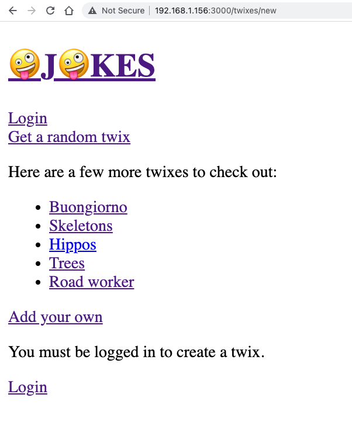

# Gestione Errori Aspettati

| Capitolo precedente  | Capitolo successivo     |
| :--------------- | ---------------: |
| [◀︎ 07-unexpected-errors](../07-unexpected-errors)| [09-seo ▶︎](../09-seo) |


A volte gli utenti fanno delle azioni che possiamo anticipare. Non stiamo parlando solamente di validazioni, ma ad esempio possono esserci errori come un utente che non è autenticato che sta eseguendo operazioni che richiedono invece di esserlo (status `401`) oppure l'utente, per il ruolo che ha, non è autorizzato (status `403`) a eseguire delle particolari azioni. Oppure semplicemente stanno cercando di andare ad una pagina che non esiste (status `404`).

Una differenza che ti può aiutare è quella di pensare agli errori inaspettati come errori che hanno un codice di livello 500 ([server errors](https://developer.mozilla.org/en-US/docs/Web/HTTP/Status#server_error_responses)) e agli errori attesti come errori di livello 400 ([client errors](https://developer.mozilla.org/en-US/docs/Web/HTTP/Status#client_error_responses)).

Ogni errore a un suo codice standard che permette di identificarlo e si chiama `status`.

Per le risposte degli errori client previsti (i `400`), Remix offre una funzione simile agli Error Boundaries che abbiamo usato nella precedente sezione: si chiamano [`Catch Boundaries`](https://remix.run/docs/en/v1.3.2-pre.0/api/conventions#catchboundary) e funzionano in modo molto simile. Nel nostro caso quando il server intercetta un problema, ci darà un oggetto [`Response`](https://developer.mozilla.org/en-US/docs/Web/API/Response). Remix poi catturerà questa risposa e renderizzerà il `CatchBoundary`. Così come `useLoaderData` viene usato per avere i dati dal `loader` e `useActionData` per avere i dati dalle `action`, anche il `CatchBoundary` ottiene i suoi dati da `useCatch` che ritornerà una `Response`.

Ti ricordiamo che questi `CatchBoundary` non servono per la validazione dei form, per quelle situazioni basta uno `useActionData`. Questi `CatchBoundary` servono invece a gestire tutte le situazione in cui l'utente fa qualcosa che non ci permette di renderizzare il nostro componente e quindi quello che vogliamo è visualizzare qualcosaltro per informare l'utente di un eventuale errore e di tutte le azioni per provvedere a sistemarlo, se possibile.

> `ErrorBoundary` e `CatchBoundary` permettono di vedere i default export come delle situazioni ideali (dette "happy path") e non preoccuparci al loro interno degli errori. Se infatti il componente viene renderizzato significa che non ci sono stati problemi (se ci fossero vedremmo il contenuto di un Error o un Catch Boundary)

Dopo aver chiarito tutto questo, andiamo avanti aggiungendo un componente `CatchBoundary` alle seguenti pagine per gestire varie situazioni:

- `app/routes/twixes/$twixId.tsx` - quando un utente tenta di accedere ad un twix che non esiste (404).
- `app/routes/twixes/new.tsx` - quando un utente prova a creare un twix senza essere autenticato (401). Per ora venivano ridirezionati alla login ogni volta che provavano a salvare un twix non essendo autenticati, ma se ci immaginiamo la situazione, per un utente sarebbe molto frustrante spendere il proprio tempo per scrivere un twix e poi essere ridirezionati al login perdendo tutti i dati e senza sapere perché. Quindi invece di ridirezionare l'utente senza spiegargli come mai, possiamo postrare un messaggio che comunica all'utente che per creare nuovi twix bisogna prima loggarsi.
- `app/routes/twixes/index.tsx` - per gestire quando non ci sono più twixes nel database e un random twix non viene trovato (404). (puoi simulare questo eliminando da MongoDB i twixes creati)
- `app/root.tsx` - per gestire tutti gli altri errori.

💿 Aggiungiamo quindi i CatchBoundaries:

<details>

<summary>app/root.tsx</summary>

```tsx filename=app/root.tsx lines=[2,57-71]
import type { LinksFunction } from "remix";
import { Links, LiveReload, Outlet, useCatch } from "remix";

function Document({
  children,
  title = `Remix: So great, it's funny!`,
}: {
  children: React.ReactNode;
  title?: string;
}) {
  return (
    <html lang="en">
      <head>
        <meta charSet="utf-8" />
        <title>{title}</title>
        <Links />
      </head>
      <body>
        {children}
        <LiveReload />
      </body>
    </html>
  );
}

export default function App() {
  return (
    <Document>
      <Outlet />
    </Document>
  );
}

export function CatchBoundary() {
  const caught = useCatch();

  return (
    <Document
      title={`${caught.status} ${caught.statusText}`}
    >
      <div className="error-container">
        <h1>
          {caught.status} {caught.statusText}
        </h1>
      </div>
    </Document>
  );
}

export function ErrorBoundary({ error }: { error: Error }) {
  return (
    <Document title="Uh-oh!">
      <div className="error-container">
        <h1>App Error</h1>
        <pre>{error.message}</pre>
      </div>
    </Document>
  );
}
```

</details>

<details>

Per gestire un Twix non esistente, dobbiamo aggiornare leggermente la `loader` in modo tale da emettere un errore 404 quando non trovo il twix con l'Id che mi è stato dato.

<summary>app/routes/twixes/$twixId.tsx</summary>

```tsx filename=app/routes/twixes/$twixId.tsx lines=[5,20-24,41-52]
import type { LoaderFunction } from "remix";
import {
  Link,
  useLoaderData,
  useCatch,
  useParams,
} from "remix";
import type { Twix } from "@prisma/client";

import { db } from "~/utils/db.server";

type LoaderData = { twix: Twix };

export const loader: LoaderFunction = async ({
  params,
}) => {
  const twix = await db.twix.findUnique({
    where: { id: params.twixId },
  });
  if (!twix) {
    throw new Response("Che twix! Non ho trovato nulla.", {
      status: 404,
    });
  }
  const data: LoaderData = { twix };
  return data;
};

export default function TwixRoute() {
  const data = useLoaderData<LoaderData>();

  return (
    <div>
      <p>Qui c'è il tuo twix divertente:</p>
      <p>{data.twix.content}</p>
      <Link to=".">{data.twix.title} Permalink</Link>
    </div>
  );
}

export function CatchBoundary() {
  const caught = useCatch();
  const params = useParams();
  if (caught.status === 404) {
    return (
      <div className="error-container">
        Huh? What the heck is "{params.twixId}"?
      </div>
    );
  }
  throw new Error(`Unhandled error: ${caught.status}`);
}

export function ErrorBoundary() {
  const { twixId } = useParams();
  return (
    <div className="error-container">{`C'è stato un problema nel caricare il twix con l'id ${twixId}. Ci scusiamo.`}</div>
  );
}
```

</details>

<details>

<summary>app/routes/twixes/index.tsx</summary>

```tsx filename=app/routes/twixes/index.tsx lines=[2,16-20,39-52]
import type { LoaderFunction } from "remix";
import { useLoaderData, Link, useCatch } from "remix";
import type { Twix } from "@prisma/client";

import { db } from "~/utils/db.server";

type LoaderData = { randomTwix: Twix };

export const loader: LoaderFunction = async () => {
  const count = await db.twix.count();
  const randomRowNumber = Math.floor(Math.random() * count);
  const [randomTwix] = await db.twix.findMany({
    take: 1,
    skip: randomRowNumber,
  });
  if (!randomTwix) {
    throw new Response("No random twix found", {
      status: 404,
    });
  }
  const data: LoaderData = { randomTwix };
  return data;
};

export default function TwixsIndexRoute() {
  const data = useLoaderData<LoaderData>();

  return (
    <div>
      <p>Here's a random twix:</p>
      <p>{data.randomTwix.content}</p>
      <Link to={data.randomTwix.id}>
        "{data.randomTwix.title}" Permalink
      </Link>
    </div>
  );
}

export function CatchBoundary() {
  const caught = useCatch();

  if (caught.status === 404) {
    return (
      <div className="error-container">
        There are no twixes to display.
      </div>
    );
  }
  throw new Error(
    `Unexpected caught response with status: ${caught.status}`
  );
}

export function ErrorBoundary() {
  return (
    <div className="error-container">
      I did a whoopsies.
    </div>
  );
}
```

</details>

<details>

<summary>app/routes/twixes/new.tsx</summary>

```tsx filename=app/routes/twixes/new.tsx lines=[6,16-24,156-167]
import type { ActionFunction, LoaderFunction } from "remix";
import {
  useActionData,
  redirect,
  json,
  useCatch,
  Link,
} from "remix";

import { db } from "~/utils/db.server";
import {
  requireUserId,
  getUserId,
} from "~/utils/session.server";

export const loader: LoaderFunction = async ({
  request,
}) => {
  const userId = await getUserId(request);
  if (!userId) {
    throw new Response("Unauthorized", { status: 401 });
  }
  return {};
};

function validateTwixContent(content: string) {
  if (content.length < 10) {
    return `That twix is too short`;
  }
}

function validateTwixTitle(title: string) {
  if (title.length < 3) {
    return `That twix's name is too short`;
  }
}

type ActionData = {
  formError?: string;
  fieldErrors?: {
    title: string | undefined;
    content: string | undefined;
  };
  fields?: {
    title: string;
    content: string;
  };
};

const badRequest = (data: ActionData) =>
  json(data, { status: 400 });

export const action: ActionFunction = async ({
  request,
}) => {
  const userId = await requireUserId(request);
  const form = await request.formData();
  const title = form.get("title");
  const content = form.get("content");
  if (
    typeof title !== "string" ||
    typeof content !== "string"
  ) {
    return badRequest({
      formError: `Form not submitted correctly.`,
    });
  }

  const fieldErrors = {
    title: validateTwixTitle(title),
    content: validateTwixContent(content),
  };
  const fields = { title, content };
  if (Object.values(fieldErrors).some(Boolean)) {
    return badRequest({ fieldErrors, fields });
  }

  const twix = await db.twix.create({
    data: { ...fields, twixesterId: userId },
  });
  return redirect(`/twixes/${twix.id}`);
};

export default function NewTwixRoute() {
  const actionData = useActionData<ActionData>();

  return (
    <div>
      <p>Add your own hilarious twix</p>
      <form method="post">
        <div>
          <label>
            Name:{" "}
            <input
              type="text"
              defaultValue={actionData?.fields?.title}
              name="title"
              aria-invalid={
                Boolean(actionData?.fieldErrors?.title) ||
                undefined
              }
              aria-errormessage={
                actionData?.fieldErrors?.title
                  ? "name-error"
                  : undefined
              }
            />
          </label>
          {actionData?.fieldErrors?.title ? (
            <p
              className="form-validation-error"
              role="alert"
              id="title-error"
            >
              {actionData.fieldErrors.title}
            </p>
          ) : null}
        </div>
        <div>
          <label>
            Content:{" "}
            <textarea
              defaultValue={actionData?.fields?.content}
              name="content"
              aria-invalid={
                Boolean(actionData?.fieldErrors?.content) ||
                undefined
              }
              aria-errormessage={
                actionData?.fieldErrors?.content
                  ? "content-error"
                  : undefined
              }
            />
          </label>
          {actionData?.fieldErrors?.content ? (
            <p
              className="form-validation-error"
              role="alert"
              id="content-error"
            >
              {actionData.fieldErrors.content}
            </p>
          ) : null}
        </div>
        <div>
          <button type="submit" className="button">
            Add
          </button>
        </div>
      </form>
    </div>
  );
}

export function CatchBoundary() {
  const caught = useCatch();

  if (caught.status === 401) {
    return (
      <div className="error-container">
        <p>You must be logged in to create a twix.</p>
        <Link to="/login">Login</Link>
      </div>
    );
  }
}

export function ErrorBoundary() {
  return (
    <div className="error-container">
      Something unexpected went wrong. Sorry about that.
    </div>
  );
}
```

</details>

Per provare questa nuova gestione degli errori, prova a fare logout e poi andare alla pagina `twxies/new` - dovresti vedere l'errore che ti dice di fare login per creare nuovi Twixes, come qui sotto:



Fantastico! Ora siamo pronti a gestire gli errori e tutto ciò senza dover modificare il codice scritto in precedenza! 🎉 Come hai potuto vedere direttamente, l'errore era circoscritto e non andava a rendere tutto il resto dell'app inutilizzabile!

## Aggiungiamo la cancellazione dei Twixes

Dato che adesso sappiamo come gestire gli errori, mettiamolo in pratica su una nuova funzionalità - la cancellazione di un Twix. Andiamo a migliorare il file `app/routes/twixes/$twixId.tsx` in modo da permettere all'utente di eliminare un proprio twix. L'eliminazione sarà possibile solo da chi ha creato il twix, se non è loro, daremo in risposta un errore `401` nel catch boundary.

Un altra cosa da tenere a mente è che i form non supportano `method="delete"` ma solamente `method="get"` e `method="post"`. Quindi per assicurarci che il nostro form funzioni, è utile fare una cosa come la seguente: 

```tsx
<form method="post">
  <input type="hidden" name="_method" value="delete" />
  <button type="submit">Delete</button>
</form>
```

E poi nella `action` possiamo verificare la tipologia andando a prendere il dato con `request.formData().get('_method')`.

💿 Aggiungi la funzionalità di eliminazione al file `app/routes/twixes/$twixId.tsx`.

<details>

<summary>app/routes/twixes/$twixId.tsx</summary>

```tsx filename=app/routes/twixes/$twixId.tsx lines=[2,7,12,31-61,71-80,89-95,103-109]
import type { Twix } from "@prisma/client";
import type { ActionFunction, LoaderFunction } from "remix";
import {
  Link,
  useLoaderData,
  useCatch,
  redirect,
  useParams,
} from "remix";

import { db } from "~/utils/db.server";
import { requireUserId } from "~/utils/session.server";

type LoaderData = { twix: Twix };

export const loader: LoaderFunction = async ({
  params,
}) => {
  const twix = await db.twix.findUnique({
    where: { id: params.twixId },
  });
  if (!twix) {
    throw new Response("What a twix! Not found.", {
      status: 404,
    });
  }
  const data: LoaderData = { twix };
  return data;
};

export const action: ActionFunction = async ({
  request,
  params,
}) => {
  const form = await request.formData();
  if (form.get("_method") !== "delete") {
    throw new Response(
      `The _method ${form.get("_method")} is not supported`,
      { status: 400 }
    );
  }
  const userId = await requireUserId(request);
  const twix = await db.twix.findUnique({
    where: { id: params.twixId },
  });
  if (!twix) {
    throw new Response("Can't delete what does not exist", {
      status: 404,
    });
  }
  if (twix.twixesterId !== userId) {
    throw new Response(
      "Pssh, nice try. That's not your twix",
      {
        status: 401,
      }
    );
  }
  await db.twix.delete({ where: { id: params.twixId } });
  return redirect("/twixes");
};

export default function TwixRoute() {
  const data = useLoaderData<LoaderData>();

  return (
    <div>
      <p>Here's your hilarious twix:</p>
      <p>{data.twix.content}</p>
      <Link to=".">{data.twix.title} Permalink</Link>
      <form method="post">
        <input
          type="hidden"
          name="_method"
          value="delete"
        />
        <button type="submit" className="button">
          Delete
        </button>
      </form>
    </div>
  );
}

export function CatchBoundary() {
  const caught = useCatch();
  const params = useParams();
  switch (caught.status) {
    case 400: {
      return (
        <div className="error-container">
          What you're trying to do is not allowed.
        </div>
      );
    }
    case 404: {
      return (
        <div className="error-container">
          Huh? What the heck is {params.twixId}?
        </div>
      );
    }
    case 401: {
      return (
        <div className="error-container">
          Sorry, but {params.twixId} is not your twix.
        </div>
      );
    }
    default: {
      throw new Error(`Unhandled error: ${caught.status}`);
    }
  }
}

export function ErrorBoundary({ error }: { error: Error }) {
  console.error(error);
  const { twixId } = useParams();
  return (
    <div className="error-container">{`There was an error loading twix by the id ${twixId}. Sorry.`}</div>
  );
}
```

</details>

Ora gli utenti riceveranno un messaggio appropriato se vogliono eliminare un twix che non appartiene a loro. In aggiunta a questo, possiamo però nascondere il pulsante di eliminazione se non è uno dei twix che hanno scritto:

<details>

<summary>app/routes/twixes/$twixId.tsx</summary>

```tsx filename=app/routes/twixes/$twixId.tsx lines=[13,17,23,34,79-90]
import type { Twix } from "@prisma/client";
import type { ActionFunction, LoaderFunction } from "remix";
import {
  Link,
  useLoaderData,
  useCatch,
  redirect,
  useParams,
} from "remix";

import { db } from "~/utils/db.server";
import {
  getUserId,
  requireUserId,
} from "~/utils/session.server";

type LoaderData = { twix: Twix; isOwner: boolean };

export const loader: LoaderFunction = async ({
  request,
  params,
}) => {
  const userId = await getUserId(request);
  const twix = await db.twix.findUnique({
    where: { id: params.twixId },
  });
  if (!twix) {
    throw new Response("What a twix! Not found.", {
      status: 404,
    });
  }
  const data: LoaderData = {
    twix,
    isOwner: userId === twix.twixesterId,
  };
  return data;
};

export const action: ActionFunction = async ({
  request,
  params,
}) => {
  const form = await request.formData();
  if (form.get("_method") !== "delete") {
    throw new Response(
      `The _method ${form.get("_method")} is not supported`,
      { status: 400 }
    );
  }
  const userId = await requireUserId(request);
  const twix = await db.twix.findUnique({
    where: { id: params.twixId },
  });
  if (!twix) {
    throw new Response("Can't delete what does not exist", {
      status: 404,
    });
  }
  if (twix.twixesterId !== userId) {
    throw new Response(
      "Pssh, nice try. That's not your twix",
      {
        status: 401,
      }
    );
  }
  await db.twix.delete({ where: { id: params.twixId } });
  return redirect("/twixes");
};

export default function TwixRoute() {
  const data = useLoaderData<LoaderData>();

  return (
    <div>
      <p>Here's your hilarious twix:</p>
      <p>{data.twix.content}</p>
      <Link to=".">{data.twix.title} Permalink</Link>
      {data.isOwner ? (
        <form method="post">
          <input
            type="hidden"
            name="_method"
            value="delete"
          />
          <button type="submit" className="button">
            Delete
          </button>
        </form>
      ) : null}
    </div>
  );
}

export function CatchBoundary() {
  const caught = useCatch();
  const params = useParams();
  switch (caught.status) {
    case 400: {
      return (
        <div className="error-container">
          What you're trying to do is not allowed.
        </div>
      );
    }
    case 404: {
      return (
        <div className="error-container">
          Huh? What the heck is {params.twixId}?
        </div>
      );
    }
    case 401: {
      return (
        <div className="error-container">
          Sorry, but {params.twixId} is not your twix.
        </div>
      );
    }
    default: {
      throw new Error(`Unhandled error: ${caught.status}`);
    }
  }
}

export function ErrorBoundary({ error }: { error: Error }) {
  console.error(error);

  const { twixId } = useParams();
  return (
    <div className="error-container">{`There was an error loading twix by the id ${twixId}. Sorry.`}</div>
  );
}
```

</details>

| Capitolo precedente  | Capitolo successivo     |
| :--------------- | ---------------: |
| [◀︎ 07-unexpected-errors](../07-unexpected-errors)| [09-seo ▶︎](../09-seo) |